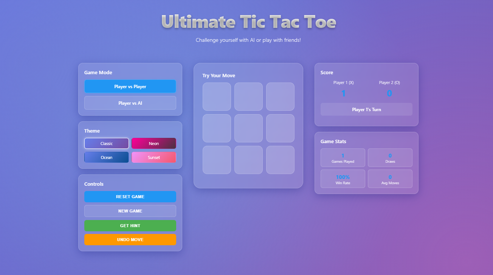

# 🎮 Ultimate Tic Tac Toe

Ultimate Tic Tac Toe is a visually engaging, interactive twist on the classic Tic Tac Toe game, offering multiple themes, modes, and advanced controls. Play solo, challenge your friends, or enjoy an AI showdown with sleek animations and rich gradients!

## Demo
[sigma-livid](https://tic-tac-toe-sigma-livid.vercel.app/)
 

## ✨ Features

- 🔁 **Game Modes**
  - Player vs Player
  - Player vs AI

- 🎨 **Themes**
  - Classic
  - Neon
  - Ocean
  - Sunset

- 🕹️ **Gameplay Controls**
  - Reset Game
  - New Game
  - Get Hint
  - Undo Move

- 📊 **Scoreboard**
  - Track player scores
  - Game stats (games played, draws, win rate, average moves)

- 🔊 **Sound Control**
  - Toggle sound on/off

## 🛠️ Technologies Used

- HTML5
- CSS3 (with gradients and glassmorphism effects)
- SCSS (for control over styling)
- JavaScript (for logic and interactions)

## 🚀 Getting Started

1. Clone the repo:
2. CSS compile command- sass --watch styles.scss:output.css
3. Go live
